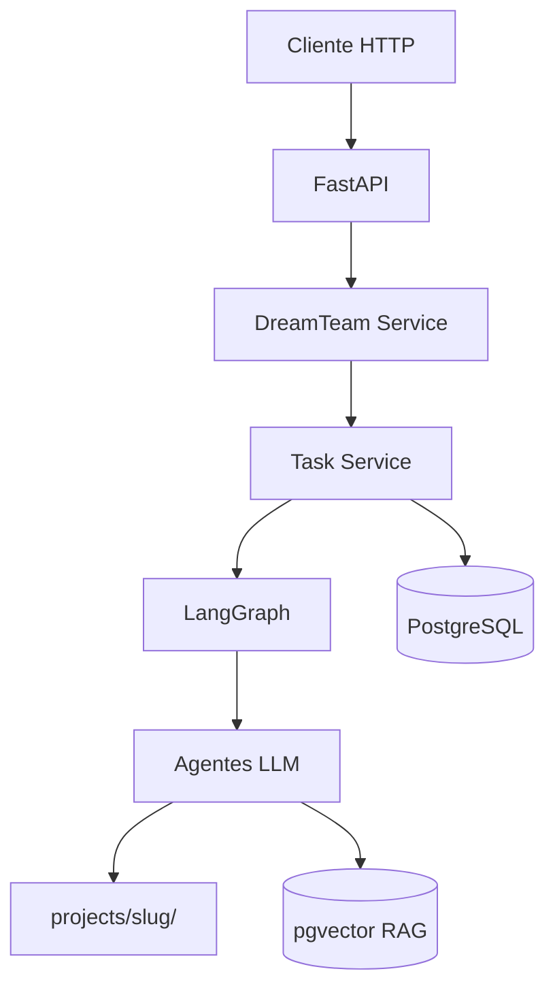
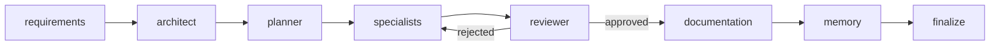

# DreamTeam — Guia completo de uso

Documentação prática da API DreamTeam: o que cada endpoint faz, como funciona por baixo dos panos e exemplos prontos para uso.

---

## Sumário

1. [Visão geral](#1-visão-geral)
2. [Pré-requisitos e instalação](#2-pré-requisitos-e-instalação)
3. [Fluxos de uso recomendados](#3-fluxos-de-uso-recomendados)
4. [Referência de endpoints](#4-referência-de-endpoints)
5. [Workflows e agentes](#5-workflows-e-agentes)
6. [Estados da task e acompanhamento](#6-estados-da-task-e-acompanhamento)
7. [Variáveis de ambiente](#7-variáveis-de-ambiente)
8. [Exemplos completos com curl](#8-exemplos-completos-com-curl)
9. [Erros comuns e soluções](#9-erros-comuns-e-soluções)

---

## 1. Visão geral

O DreamTeam é uma plataforma **multi-agentes** que:

1. Recebe uma **demanda** (o que você precisa construir ou corrigir).
2. Monta um **time de agentes** (requirements, architect, backend, etc.).
3. Executa um **grafo LangGraph** determinístico — cada agente chama um LLM, valida a saída e grava artefatos.
4. Materializa o código em `projects/{slug}/`.



### Conceitos-chave

| Conceito | Descrição |
|----------|-----------|
| **DreamTeam** | Configuração persistida: projeto + workflow + lista de agentes + modelos |
| **Task** | Uma execução do grafo para uma demanda; retorna `task_id` para acompanhamento |
| **Workflow** | Template de fluxo (`new-feature`, `bugfix`, `refactor`) |
| **Agente** | Persona definida em Markdown no bundle `agents/` |
| **Bundle de agentes** | Pasta `agents/` (ou path externo via `AGENTS_BUNDLE_DIR`) com default, custom, skills, instructions e plugins |

---

## 2. Pré-requisitos e instalação

### Infraestrutura

- Python 3.11+
- Docker (PostgreSQL + Redis)
- Chave de API de pelo menos um provider LLM (OpenAI, Anthropic ou Google)

### Subir o ambiente

```bash
cp .env.example .env
# Edite .env e preencha OPENAI_API_KEY (ou outro provider)

docker compose up -d postgres redis
pip install -e ".[dev]"
alembic upgrade head
uvicorn src.main:app --reload
```

### Verificar saúde

```bash
curl http://localhost:8000/health
```

Resposta esperada:

```json
{"status": "ok", "version": "1.0.0"}
```

### Documentação interativa (Swagger)

Abra no navegador: **http://localhost:8000/docs**

---

## 3. Fluxos de uso recomendados

### Fluxo A — Work your magic (mais simples)

Ideal para **usuário final** que só sabe o pedido, responsável e sigla do projeto.

```
POST /work-your-magic
    → cria/reutiliza DreamTeam
    → escolhe workflow e agentes automaticamente
    → inicia execução
    → retorna task_id
GET /tasks/{task_id}
    → acompanha progresso
GET /projects/{slug}
    → vê arquivos gerados
```

### Fluxo B — DreamTeam manual (controle total)

Ideal quando você quer **definir projeto, workflow e agentes** explicitamente.

```
POST /dream-teams          → configura time (não executa)
POST /dream-teams/{id}/run → envia prompt e executa
GET /tasks/{task_id}       → acompanha
GET /projects/{slug}       → resultados
```

### Fluxo C — Retomar execução

Se a task foi pausada ou precisa de continuação com novo contexto:

```
POST /tasks/continue
GET /tasks/{task_id}
```

---

## 4. Referência de endpoints

Base URL padrão: `http://localhost:8000`

---

### 4.1 Sistema

#### `GET /health`

**O que faz:** Verifica se a API está no ar.

**Resposta:** `{ "status": "ok", "version": "..." }`

---

#### `GET /workflows`

**O que faz:** Lista os workflows disponíveis.

**Resposta:**

```json
{
  "workflows": ["new-feature", "bugfix", "refactor"]
}
```

**Como escolher:**

| Workflow | Quando usar |
|----------|-------------|
| `new-feature` | Funcionalidade nova completa (requirements → architect → specialists → reviewer) |
| `bugfix` | Correção de bug (sem architect; revisões limitadas) |
| `refactor` | Refatoração (começa em architect; sem requirements) |

---

### 4.2 Work your magic

#### `POST /work-your-magic`

**O que faz:** Fluxo **tudo-em-um**. Recebe demanda + dados essenciais, infere workflow/time, cria ou reutiliza projeto e **inicia a execução**.

**Como funciona internamente:**

1. `build_project_from_demand()` monta metadados do projeto a partir do pedido.
2. `TeamMatcher` classifica o workflow por palavras-chave no pedido.
3. Filtra specialists (backend, frontend, etc.) por keywords no texto.
4. Se já existir DreamTeam com a mesma sigla → reutiliza.
5. Caso contrário → `POST /dream-teams` implícito.
6. Executa o grafo e retorna `task_id`.

**Body (JSON):**

| Campo | Obrigatório | Descrição |
|-------|-------------|-----------|
| `pedido` | sim | Demanda técnica (mín. 3 caracteres) |
| `responsavel` | sim | Nome do responsável |
| `sigla` | sim | Sigla única do projeto (ex.: `ESTQ`) — normalizada para maiúsculas |
| `nome_projeto` | não | Inferido do pedido se omitido |
| `descricao` | não | Usa o `pedido` se omitida |

**Exemplo:**

```json
{
  "pedido": "Preciso de uma API REST de estoque com PostgreSQL e testes",
  "responsavel": "Maria Silva",
  "sigla": "ESTQ",
  "nome_projeto": "Sistema de Estoque ACME"
}
```

**Resposta (200):**

```json
{
  "task_id": "uuid-da-task",
  "dream_team_id": "uuid-do-time",
  "project_slug": "sistema-de-estoque-acme-estq",
  "project_path": "projects/sistema-de-estoque-acme-estq",
  "workflow": "new-feature",
  "agents": ["requirements", "architect", "planner", "backend", "reviewer", "memory"],
  "rationale": "Workflow detectado: new-feature. ...",
  "status": "running"
```

**Erros:**

| Código | Motivo |
|--------|--------|
| 422 | Validação falhou (sigla inválida, campos obrigatórios ausentes) |

---

### 4.3 Dream Teams

#### `POST /dream-teams`

**O que faz:** Cria um **DreamTeam** (projeto + composição do time). **Não executa** o grafo.

**Como funciona internamente:**

1. Cria registro do projeto no PostgreSQL e pasta em `projects/{slug}/`.
2. Persiste DreamTeam com workflow, agentes e overrides de modelo.
3. Grava `.dreamteam/team.json` no projeto.

**Body (JSON):**

```json
{
  "project": {
    "system_name": "Sistema de Pagamentos ACME",
    "system_description": "Plataforma para cobrança e conciliação bancária",
    "owner_name": "Maria Silva",
    "owner_email": "maria@acme.com",
    "area": "financeiro",
    "stack_hint": "python-fastapi",
    "organization": "ACME Corp",
    "additional_context": { "sigla": "PAGTO" }
  },
  "workflow": "new-feature",
  "agents": ["requirements", "architect", "planner", "backend", "reviewer", "memory"],
  "models": [
    {
      "agent": "backend",
      "provider": "anthropic",
      "model": "claude-3-5-sonnet-20241022",
      "temperature": 0.2
    }
  ],
  "user_id": "usuario-opcional"
}
```

| Campo | Obrigatório | Descrição |
|-------|-------------|-----------|
| `project` | sim | Metadados do projeto |
| `workflow` | não | Default: `new-feature` |
| `agents` | não | Default: agentes do workflow |
| `models` | não | Override de modelo por agente |
| `user_id` | não | Identificador do usuário |

**Resposta (200):**

```json
{
  "dream_team_id": "uuid",
  "project_slug": "sistema-de-pagamentos-acme",
  "project_path": "projects/sistema-de-pagamentos-acme",
  "workflow": "new-feature",
  "agents": ["requirements", "architect", "..."],
  "status": "ready"
}
```

---

#### `POST /dream-teams/{team_id}/run`

**O que faz:** Executa o grafo para um DreamTeam **já configurado**. Você envia apenas o prompt.

**Parâmetro de path:** `team_id` — UUID retornado em `POST /dream-teams`.

**Body (JSON):**

```json
{
  "prompt": "Adicionar módulo de relatórios PDF com filtros por data",
  "models": [
    {
      "agent": "reviewer",
      "provider": "openai",
      "model": "gpt-4o",
      "temperature": 0.0
    }
  ]
}
```

| Campo | Obrigatório | Descrição |
|-------|-------------|-----------|
| `prompt` | sim | Demanda técnica (mín. 3 caracteres) |
| `models` | não | Override de modelo só nesta execução |

**Resposta (200):**

```json
{
  "task_id": "uuid",
  "dream_team_id": "uuid",
  "project_slug": "sistema-de-pagamentos-acme",
  "project_path": "projects/sistema-de-pagamentos-acme",
  "status": "running",
  "message": "Execução iniciada"
}
```

**Erros:**

| Código | Motivo |
|--------|--------|
| 400 | `team_id` não é UUID válido |
| 404 | DreamTeam não encontrado |

**Nota:** A execução é **assíncrona**. Use `GET /tasks/{task_id}` para acompanhar.

---

### 4.4 Tasks

#### `GET /tasks/{task_id}`

**O que faz:** Consulta status, steps executados e resultado de uma task.

**Parâmetro:** `task_id` — UUID retornado por `/run` ou `/work-your-magic`.

**Resposta (200):**

```json
{
  "id": "uuid",
  "project_id": "sistema-de-estoque-acme-estq",
  "project_slug": "sistema-de-estoque-acme-estq",
  "project_path": "projects/sistema-de-estoque-acme-estq",
  "files_written_count": 12,
  "workflow": "new-feature",
  "demand": "## CONTEXTO DO PROJETO\n...",
  "status": "completed",
  "result": {
    "approved": true,
    "artifacts": { "backend": { "artifacts": [...] } },
    "visited_agents": ["orchestrator", "requirements", "..."],
    "project_path": "projects/..."
  },
  "error": null,
  "thread_id": "task-uuid",
  "created_at": "2026-05-29T12:00:00",
  "updated_at": "2026-05-29T12:05:00",
  "steps": [
    {
      "agent": "requirements",
      "model_provider": "openai",
      "model_name": "gpt-4o-mini",
      "model_source": "agent_default",
      "tokens_estimated": 1500,
      "latency_ms": 3200,
      "created_at": "2026-05-29T12:01:00"
    }
  ]
}
```

**Status possíveis:**

| Status | Significado |
|--------|-------------|
| `running` | Grafo em execução |
| `completed` | Finalizou com sucesso (review aprovado ou memory concluído) |
| `completed_with_issues` | Finalizou, mas review não aprovou totalmente |
| `failed` | Erro durante execução — ver campo `error` |

---

#### `POST /tasks/continue`

**O que faz:** Retoma uma task pausada via checkpointer LangGraph, opcionalmente com nova mensagem ou novos modelos.

**Body (JSON):**

```json
{
  "task_id": "uuid-da-task",
  "message": "Corrija o endpoint de login para usar JWT",
  "models": [
    {
      "agent": "backend",
      "provider": "openai",
      "model": "gpt-4o",
      "temperature": 0.2
    }
  ]
}
```

| Campo | Obrigatório | Descrição |
|-------|-------------|-----------|
| `task_id` | sim | UUID da task |
| `message` | não | Contexto adicional anexado à demanda |
| `models` | não | Override de modelos na retomada |

**Resposta (200):**

```json
{
  "id": "uuid",
  "status": "running",
  "message": "Task retomada"
}
```

**Erros:**

| Código | Motivo |
|--------|--------|
| 404 | Task não encontrada ou já em processamento (lock Redis) |

---

#### `POST /tasks/create-system` (descontinuado)

**Retorna 410 Gone.** Use:

- `POST /dream-teams` + `POST /dream-teams/{id}/run`, ou
- `POST /work-your-magic`

---

### 4.5 Projects

#### `GET /projects/{slug}`

**O que faz:** Retorna metadados e lista de arquivos gerados de um projeto.

**Parâmetro:** `slug` — identificador do projeto (ex.: `sistema-de-estoque-acme-estq`).

**Resposta (200):**

```json
{
  "id": "uuid",
  "slug": "sistema-de-estoque-acme-estq",
  "system_name": "Sistema de Estoque ACME",
  "system_description": "...",
  "owner_name": "Maria Silva",
  "owner_email": "maria@acme.com",
  "area": "operacoes",
  "stack_hint": "python-fastapi",
  "stack_resolved": "python-fastapi",
  "root_path": "projects/sistema-de-estoque-acme-estq",
  "files": [
    "src/main.py",
    "docs/architecture.json",
    "docs/specification.json"
  ],
  "created_at": "2026-05-29T12:00:00"
}
```

**Erros:**

| Código | Motivo |
|--------|--------|
| 404 | Projeto não encontrado |

---

### 4.6 Agents

Gerenciamento de agentes customizados via **banco de dados**. Agentes de sistema ficam em `agents/default/*.md`.

#### `GET /agents/{agent_id}`

**O que faz:** Busca agente por slug (`backend`, `reviewer`) ou UUID (custom no DB).

**Resposta (200):**

```json
{
  "id": "backend",
  "slug": "backend",
  "name": "backend",
  "role": "Desenvolvedor backend senior...",
  "default_provider": "openai",
  "default_model": "gpt-4o-mini",
  "tools": [],
  "permissions": [],
  "restrictions": {},
  "visibility": "public",
  "is_custom": false,
  "source": "default"
}
```

**Campo `source`:**

| Valor | Origem |
|-------|--------|
| `default` | `agents/default/{slug}.md` |
| `file` | `agents/custom/{slug}.md` |
| `db` | Criado via `POST /agents/create` |

**Ordem de resolução ao executar:** `custom/` → `default/` → PostgreSQL.

---

#### `POST /agents/create`

**O que faz:** Cria agente customizado no PostgreSQL.

**Body (JSON):**

```json
{
  "name": "Meu Especialista PDF",
  "role": "Gera relatórios PDF",
  "prompt_md": "# PDF Agent\n\n## DEFAULT_MODEL\n- provider: openai\n- model: gpt-4o-mini\n- temperature: 0.2\n\n## ROLE\nEspecialista em PDF",
  "model": {
    "agent": "pdf-agent",
    "provider": "openai",
    "model": "gpt-4o-mini",
    "temperature": 0.2
  },
  "tools": ["path_guard", "artifact_validator"],
  "permissions": [],
  "restrictions": {},
  "visibility": "private"
}
```

**Erros:**

| Código | Motivo |
|--------|--------|
| 409 | Slug já existe (DB, custom file ou conflito com agente de sistema) |

---

#### `POST /agents/update`

**O que faz:** Atualiza agente customizado existente no DB.

**Body (JSON):**

```json
{
  "id": "uuid-do-agente-no-db",
  "role": "Nova descrição",
  "prompt_md": "...",
  "model": {
    "agent": "pdf-agent",
    "provider": "openai",
    "model": "gpt-4o",
    "temperature": 0.1
  }
}
```

---

## 5. Workflows e agentes

### 5.1 Pipeline do grafo (workflow `new-feature`)



1. **requirements** — Especificação funcional (`docs/specification.json`)
2. **architect** — Stack e arquitetura (`docs/architecture.json`)
3. **planner** — Decomposição em tasks por specialist
4. **specialists** — backend, frontend, database, devops, security (em paralelo quando possível)
5. **reviewer** — Gate de qualidade; issues `high` bloqueiam aprovação
6. **documentation** — Docs finais (após review aprovado)
7. **memory** — Indexa decisões no RAG

### 5.2 Bundle de agentes (`AGENTS_BUNDLE_DIR`)

```
agents/
├── default/        # Agentes de sistema (*.md)
├── custom/         # Agentes custom via arquivo
├── skills/         # Conhecimento — referenciado em ## SKILLS
├── instructions/   # Regras globais — injetadas em TODOS os agentes
└── plugins/        # Validadores Python — referenciados em ## PLUGINS
```

Para apontar bundle externo:

```bash
AGENTS_BUNDLE_DIR=/caminho/para/bundle-externo
```

### 5.3 Override de modelos

Prioridade de resolução do modelo (maior → menor):

1. Override do orchestrator (economia forçada)
2. Override do usuário na requisição (`models` no body)
3. Modelo definido no workflow YAML
4. Modelo default do agente (`.md`)
5. Default do sistema

Providers configurados em `config/providers.yaml`: `openai`, `anthropic`, `google`, `ollama`, `vllm`.

---

## 6. Estados da task e acompanhamento

### Ciclo de vida

```
POST /run ou /work-your-magic
        ↓
   status: running
        ↓
   GET /tasks/{id}  (poll a cada 5–15s)
        ↓
   status: completed | completed_with_issues | failed
        ↓
   GET /projects/{slug}  (ver arquivos)
```

### Onde ficam os artefatos

```
projects/{slug}/
├── project.json
├── README.md
├── .dreamteam/
│   ├── team.json       # configuração do time
│   └── manifest.json   # arquivos escritos por agente
├── docs/
│   ├── specification.json
│   └── architecture.json
└── src/                # código gerado
```

### Campos úteis em `result`

| Campo | Descrição |
|-------|-----------|
| `approved` | Se o reviewer aprovou |
| `artifacts` | Output JSON de cada specialist |
| `review_result` | Issues e refactor_requests |
| `files_written_count` | Total de arquivos gravados |
| `visited_agents` | Sequência de agentes executados |

---

## 7. Variáveis de ambiente

| Variável | Default | Descrição |
|----------|---------|-----------|
| `DATABASE_URL` | postgres local | Conexão async PostgreSQL |
| `REDIS_URL` | redis local | Cache e locks |
| `OPENAI_API_KEY` | — | Provider OpenAI |
| `ANTHROPIC_API_KEY` | — | Provider Anthropic |
| `GOOGLE_API_KEY` | — | Provider Google |
| `OLLAMA_BASE_URL` | localhost:11434 | LLM local via Ollama |
| `PROJECTS_DIR` | `./projects` | Onde projetos são materializados |
| `AGENTS_BUNDLE_DIR` | `./agents` | Bundle completo de agentes |
| `MAX_ITERATIONS` | 20 | Limite de iterações do grafo |
| `MAX_AGENT_REVISITS` | 3 | Máximo de revisitas por agente |
| `REQUEST_TIMEOUT_SECONDS` | 120 | Timeout de requisições LLM |

---

## 8. Exemplos completos com curl

### Exemplo 1 — Fluxo rápido (work your magic)

```bash
# 1. Executar
curl -s -X POST http://localhost:8000/work-your-magic \
  -H "Content-Type: application/json" \
  -d '{
    "pedido": "API REST de estoque com PostgreSQL, autenticação JWT e testes pytest",
    "responsavel": "Maria Silva",
    "sigla": "ESTQ",
    "nome_projeto": "Sistema de Estoque ACME"
  }' | jq .

# 2. Acompanhar (substitua TASK_ID)
curl -s http://localhost:8000/tasks/TASK_ID | jq '.status, .files_written_count, .steps[-1]'

# 3. Ver projeto gerado
curl -s http://localhost:8000/projects/SLUG_DO_PROJETO | jq '.files'
```

### Exemplo 2 — Fluxo manual com controle

```bash
# 1. Criar DreamTeam
curl -s -X POST http://localhost:8000/dream-teams \
  -H "Content-Type: application/json" \
  -d '{
    "project": {
      "system_name": "Portal de Vendas",
      "system_description": "Sistema de gestão de vendas B2B",
      "owner_name": "João Santos",
      "owner_email": "joao@empresa.com",
      "area": "comercial",
      "stack_hint": "python-fastapi"
    },
    "workflow": "new-feature",
    "agents": ["requirements", "architect", "planner", "backend", "reviewer", "memory"]
  }' | jq .

# 2. Executar (substitua TEAM_ID)
curl -s -X POST http://localhost:8000/dream-teams/TEAM_ID/run \
  -H "Content-Type: application/json" \
  -d '{
    "prompt": "Implementar CRUD de clientes com validação Pydantic e testes"
  }' | jq .

# 3. Acompanhar
curl -s http://localhost:8000/tasks/TASK_ID | jq .
```

### Exemplo 3 — Bugfix

```bash
curl -s -X POST http://localhost:8000/work-your-magic \
  -H "Content-Type: application/json" \
  -d '{
    "pedido": "Corrigir erro 500 no endpoint POST /orders quando payload está vazio",
    "responsavel": "Dev Team",
    "sigla": "ORDFIX"
  }' | jq .
```

O matcher detectará `bugfix` pelas palavras "corrigir" e "erro".

---

## 9. Erros comuns e soluções

| Problema | Causa provável | Solução |
|----------|----------------|---------|
| Task fica `running` muito tempo | Execução LLM lenta ou muitos agentes | Aguarde; verifique `steps` em `GET /tasks/{id}` |
| Task `failed` | API key inválida ou provider indisponível | Verifique `.env` e logs do uvicorn |
| `422` em work-your-magic | Sigla inválida ou campos curtos demais | Sigla com 2+ caracteres alfanuméricos |
| `404` em run | DreamTeam ID errado | Use UUID retornado em `POST /dream-teams` |
| Nenhum arquivo em `projects/` | Review bloqueou ou specialists falharam | Veja `result.review_result` na task |
| `Connection refused` PostgreSQL | Docker não subiu | `docker compose up -d postgres redis` |
| Agente custom não executa no grafo | Custom agents não estão em `AGENT_NODES` | Use agentes listados no workflow ou default |

---

## Referência rápida de endpoints

| Método | Endpoint | Ação |
|--------|----------|------|
| GET | `/health` | Health check |
| GET | `/workflows` | Listar workflows |
| POST | `/work-your-magic` | Fluxo completo automático |
| POST | `/dream-teams` | Criar time (sem executar) |
| POST | `/dream-teams/{id}/run` | Executar prompt no time |
| GET | `/tasks/{id}` | Status e steps da task |
| POST | `/tasks/continue` | Retomar task |
| GET | `/projects/{slug}` | Metadados e arquivos do projeto |
| GET | `/agents/{id}` | Consultar agente |
| POST | `/agents/create` | Criar agente custom (DB) |
| POST | `/agents/update` | Atualizar agente custom (DB) |

---

*Documentação gerada para DreamTeam v1.0.0 — Swagger interativo em `/docs`.*
